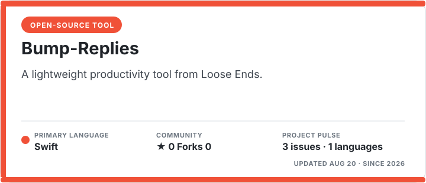
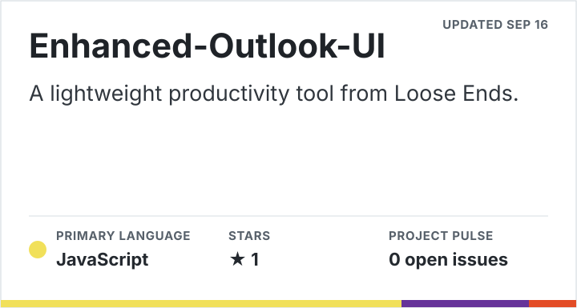
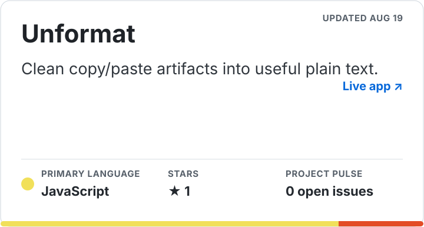

# Loose Ends

  

  <strong>Lightweight productivity tools for tying up the loose ends in your digital life.</strong>

## Tools

<!-- repository-cards:start -->
 

&nbsp;

 

 
 
<!-- repository-cards:end -->

The collection is taking shape, starting with tools for surfacing conversations and tasks that need a follow-up. This section refreshes daily as repositories are published.
